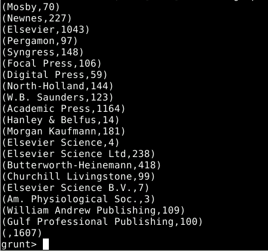
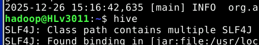

# Hadoop Publishing Analytics — Pig vs Hive

Same workload, two stacks. The project answers four analytical questions about a publishing catalogue (titles by year, counts by publisher, joins between catalogue and publisher) **twice** — once in **Pig Latin** and once in **HiveQL** — over the same source CSVs sitting in HDFS. The results match query-for-query, so the value of the project is the **side-by-side comparison** of the two paradigms: declarative SQL on Hive vs imperative dataflow on Pig.

The four queries are deliberately representative of common ETL primitives: a filter projection, an aggregate count, a `GROUP BY` aggregation, and a join. They map cleanly to the same MapReduce stages on disk regardless of whether they're expressed in Pig or HiveQL — but the developer ergonomics are very different.

---

## Tech stack

| Area | Choice |
|------|--------|
| Storage | HDFS (Hadoop Distributed File System) |
| Compute | MapReduce (`pig -x mapreduce`, Hive default execution engine) |
| Pig | Pig Latin via `pig` CLI (grunt shell) |
| Hive | HiveQL via `hive` CLI |

---

## Source data

Two CSVs in HDFS root, both loaded once and reused across the four queries:

| File | Schema |
|---|---|
| `/ebooks.csv` | `isbn:STRING, title:STRING, author:STRING, year:INT` |
| `/epublishing.csv` | `isbn:STRING, editorial:STRING` |

`isbn` is the natural join key between the two relations.

```bash
hadoop fs -copyFromLocal ebooks.csv      /ebooks.csv
hadoop fs -copyFromLocal epublishing.csv /epublishing.csv
```


---

## Project layout

```
hadoop-publishing-analytics-pig-hive/
├── pig/                          # Pig Latin scripts
│   ├── 00-load.pig               # LOAD ebooks + epub
│   ├── q1-books-published-2000.pig
│   ├── q2-count-books-1980.pig
│   ├── q3-books-per-publisher.pig
│   └── q4-books-by-elsevier.pig
├── hive/                         # HiveQL scripts (equivalent semantics)
│   ├── 00-create-tables.hql      # CREATE TABLE + LOAD DATA
│   ├── q1-books-published-2000.hql
│   ├── q2-count-books-1980.hql
│   ├── q3-books-per-publisher.hql
│   └── q4-books-by-elsevier.hql
└── screenshots/                  # real outputs from the practice run
```

---

## Pig stage

In `pig -x mapreduce`, both relations are loaded once with `PigStorage(',')`:

```pig
ebooks = LOAD '/ebooks.csv'
         USING PigStorage(',')
         AS (isbn:chararray, title:chararray, author:chararray, year:int);

epub   = LOAD '/epublishing.csv'
         USING PigStorage(',')
         AS (isbn:chararray, editorial:chararray);
```


### Q1 — Books published in 2000

```pig
B = FILTER ebooks BY year == 2000;
C = FOREACH B GENERATE title, author;
DUMP C;
STORE C INTO '/query1' USING PigStorage(',');
```


`STORE` materialises the result into HDFS (and leaves it as a directory of part files), so it can be pulled back to the local FS:


### Q2 — Count of books published in 1980

```pig
t2_B = FILTER ebooks BY year == 1980;
t2_C = GROUP t2_B ALL;
t2_C = FOREACH t2_C GENERATE COUNT(t2_B);
DUMP t2_C;
STORE t2_C INTO '/query2' USING PigStorage(',');
```

The `GROUP … ALL` collapses every row into a single bag, then `COUNT` aggregates over it. Result on this dataset: **42 books**.


### Q3 — Number of books per publisher

```pig
t3_B = GROUP epub BY editorial;
t3_C = FOREACH t3_B GENERATE group AS editorial, COUNT(epub) AS n_libros;
DUMP t3_C;
STORE t3_C INTO '/query3' USING PigStorage(',');
```



### Q4 — Books published by Elsevier

```pig
t4_B = FILTER epub  BY editorial == 'Elsevier';
t4_C = JOIN   t4_B  BY isbn,  ebooks BY isbn;
t4_D = FOREACH t4_C GENERATE ebooks::title, ebooks::author, ebooks::year;
DUMP t4_D;
STORE t4_D INTO '/query4' USING PigStorage(',');
```

Pre-filtering `epub` to Elsevier before the JOIN keeps the JOIN input small — Pig pushes the filter into the map side at planning time anyway, but writing it in this order is the clearer way to express intent.


---

## Hive stage

The same workload over Hive starts with two `CREATE TABLE` declarations and a `LOAD DATA` ingestion step. From that point on, the queries are plain SQL.

```sql
CREATE TABLE IF NOT EXISTS ebooks (
    isbn STRING, title STRING, author STRING, year INT
)
ROW FORMAT DELIMITED FIELDS TERMINATED BY ','
STORED AS TEXTFILE;

CREATE TABLE IF NOT EXISTS epublishing (
    isbn STRING, editorial STRING
)
ROW FORMAT DELIMITED FIELDS TERMINATED BY ','
STORED AS TEXTFILE;

LOAD DATA INPATH '/ebooks.csv'      OVERWRITE INTO TABLE ebooks;
LOAD DATA INPATH '/epublishing.csv' OVERWRITE INTO TABLE epublishing;
```



The four queries below all use `INSERT OVERWRITE DIRECTORY` so the result lands in HDFS in the same `/queryN` paths the Pig versions used — making the artefacts directly comparable.

### Q1 — Books published in 2000

```sql
INSERT OVERWRITE DIRECTORY '/query1'
ROW FORMAT DELIMITED FIELDS TERMINATED BY ','
SELECT title, author
FROM   ebooks
WHERE  year = 2000;
```


### Q2 — Count of books published in 1980

```sql
INSERT OVERWRITE DIRECTORY '/query2'
ROW FORMAT DELIMITED FIELDS TERMINATED BY ','
SELECT COUNT(*)
FROM   ebooks
WHERE  year = 1980;
```

Result: **42 books** — same value as the Pig version, which is the sanity check that confirms the two stacks agree on the same dataset.


### Q3 — Number of books per publisher

```sql
INSERT OVERWRITE DIRECTORY '/query3'
ROW FORMAT DELIMITED FIELDS TERMINATED BY ','
SELECT editorial, COUNT(*)
FROM   epublishing
GROUP  BY editorial;
```


### Q4 — Books published by Elsevier

```sql
INSERT OVERWRITE DIRECTORY '/query4'
ROW FORMAT DELIMITED FIELDS TERMINATED BY ','
SELECT e.title, e.author, e.year
FROM   ebooks e
JOIN   epublishing p ON (e.isbn = p.isbn)
WHERE  p.editorial = 'Elsevier';
```


---

## Pig vs Hive — what changes, what doesn't

The four queries are equivalent on disk: every Hive query above compiles to a MapReduce DAG very similar to the corresponding Pig pipeline. The output columns and row counts match. What changes is the **mental model**:

| | Pig Latin | HiveQL |
|---|---|---|
| Style | Imperative dataflow (`A = LOAD`; `B = FILTER A`; `C = FOREACH B`) | Declarative SQL (`SELECT … FROM … WHERE`) |
| Schema | Inline at `LOAD` time, or untyped (`bytearray`) | Defined upfront via `CREATE TABLE` |
| Side files | Each `STORE` writes a fresh `_SUCCESS`-marked directory | `INSERT OVERWRITE` replaces the destination directory |
| When to reach for it | Highly iterative ETL, ad-hoc transformations, exploratory pipelines | Analytics on a stable schema, BI tools that speak SQL, governance-friendly metastore |

In an interview-grade summary: Pig wins when the schema is fluid and the pipeline shape is not yet stable; Hive wins when the schema is settled and the consumers expect SQL. Both compile down to the same execution layer, so the choice is mostly about who is going to maintain the pipeline.

---

## How to run

Assumes a working single-node or pseudo-distributed Hadoop install with HDFS available, and a copy of `ebooks.csv` and `epublishing.csv` placed in HDFS root.

```bash
# Stage the CSVs
hadoop fs -copyFromLocal ebooks.csv      /ebooks.csv
hadoop fs -copyFromLocal epublishing.csv /epublishing.csv

# Pig stage
pig -x mapreduce
grunt> exec pig/00-load.pig
grunt> exec pig/q1-books-published-2000.pig
grunt> exec pig/q2-count-books-1980.pig
grunt> exec pig/q3-books-per-publisher.pig
grunt> exec pig/q4-books-by-elsevier.pig

# Hive stage
hive
hive> source hive/00-create-tables.hql;
hive> source hive/q1-books-published-2000.hql;
hive> source hive/q2-count-books-1980.hql;
hive> source hive/q3-books-per-publisher.hql;
hive> source hive/q4-books-by-elsevier.hql;

# Pull the artefacts back to local
hadoop fs -copyToLocal /query1 ./out/pig-q1   # or hive-q1, depending on which stack you ran last
```

---

## Reference

Implementation of the **Hadoop practice (Tema 8)** of *Big Data*, MU Tecnologías del Sector Financiero (UC3M, 2025/2026): four analytical queries over an `ebooks` / `epublishing` dataset, expressed first in Pig Latin and then in HiveQL.
