# Linked Open Data Pipeline — Nobel Laureates in Physics

End-to-end **Linked Open Data engineering** project covering the full data-life-cycle on a real-world target: build a clean, deduplicated, semantically enriched dataset of every **Nobel laureate in Physics**, by combining three independent open sources: DBpedia (a structured projection of Wikipedia), the official Nobel Prize REST API, and Wikidata (for reconciliation and enrichment).

The pipeline goes through every canonical stage of a LOD project:

1. **Acquisition (SPARQL)** — query DBpedia for everyone in `dbc:Nobel_laureates_in_Physics` with their label, abstract, birth date, birth place and country. Export as CSV.
2. **Acquisition (REST)** — pull the same laureates from the Nobel Prize API (`/laureates?nobelPrizeCategory=phy`). Export the JSON.
3. **Cleaning & integration (OpenRefine + GREL)** — load both sources into separate OpenRefine projects, build a normalised join key, and merge them column by column with `cross()`.
4. **Reconciliation (Wikidata)** — match every row to a Wikidata `Q5` entity (human) through the public reconciliation service.
5. **Enrichment (Wikidata)** — add Wikidata-only properties not present in either source: *educated at, employer, academic degree, award received, field of work, influenced by*.
6. **Export** — final dataset (`.xls`) plus the OpenRefine operation history (`.json`), so the whole pipeline is reproducible end to end.

---

## Tech stack

| Stage | Tool / Service |
| :--- | :--- |
| RDF query | DBpedia SPARQL endpoint — <https://dbpedia.org/sparql> |
| REST | Nobel Prize API v2.1 — <https://api.nobelprize.org/2.1/laureates> |
| Cleaning + integration | OpenRefine 3.x · GREL · `cross()` |
| Reconciliation | Wikidata reconciliation service — <https://wikidata.reconci.link/en/api> |
| Enrichment | Wikidata SPARQL service — <https://query.wikidata.org/> |

---

## Pipeline diagram

```
                                      DBpedia                                   Nobel Prize REST API
                       (https://dbpedia.org/sparql)                  (https://api.nobelprize.org/2.1/...)
                                  │                                                │
                  SPARQL Q over dbc:Nobel_                              GET /laureates?nobelPrizeCategory=phy
                  laureates_in_Physics                                                │
                                  │                                                  │
                              CSV export                                       JSON response
                                  │                                                  │
                                  v                                                  v
                  ┌──────────────────────────────┐               ┌──────────────────────────────┐
                  │  OpenRefine project          │               │  OpenRefine project          │
                  │  dbpedia_nobel_physics       │               │  api_nobel_physics           │
                  │  cols: person, personLabel,  │               │  cols: id, givenName,        │
                  │        birthDate, ...        │               │        familyName, fullName, │
                  │                              │               │        nobelPrizes, ...      │
                  └──────────────┬───────────────┘               └──────────────┬───────────────┘
                                  │                                              │
                          GREL: build "join"                            GREL: build fullName
                          fingerprint key                               GREL: build "join" key
                                  │                                              │
                                  └──────────────► cross() pull ◄────────────────┘
                                                          │
                                            api_nobel_physics  (merged columns)
                                                          │
                                                          v
                                          Wikidata reconciliation (Q5 = human)
                                                          │
                                            api_nobel_physics  (Wikidata IDs added)
                                                          │
                                                          v
                                       Wikidata enrichment (educated at, employer,
                                       academic degree, award received, field of work,
                                       influenced by, ...)
                                                          │
                                                          v
                                  Final dataset (.xls) + operation history (.json)
```

---

## Project layout

```
linked-open-data-nobel-physics-pipeline/
├── sparql/
│   ├── README.md                  # Query catalogue + DBpedia prefix cheatsheet
│   ├── main-nobel-laureates-physics.sparql
│   ├── warmup-01-gmail-info.sparql
│   ├── warmup-02-discover-resource-by-homepage.sparql
│   ├── warmup-03-products-by-google.sparql
│   ├── warmup-04-creators-with-pagination.sparql
│   ├── ask-01-paris-as-un-country.sparql
│   └── ask-02-bombay-vs-ny-population.sparql
├── grel/
│   ├── README.md                  # GREL pipeline catalogue
│   ├── 01-construct-fullname.grel
│   ├── 02-normalize-join-key.grel
│   ├── 03-cross-bring-birthdate.grel
│   ├── 04-cross-bring-birthplace.grel
│   ├── 05-cross-bring-country.grel
│   ├── 06-cross-bring-uri-and-abstract.grel
│   └── 07-cross-aggregate-multiple-matches.grel
├── api/
│   └── nobel-laureates-endpoint.md  # Nobel Prize API reference
└── screenshots/                     # 12 curated screenshots from the practice run
```

---

## Stage 1 — Acquisition with SPARQL

The DBpedia source for the pipeline is built around the `Nobel_laureates_in_Physics` category. The DBpedia model attaches resources to categories via Dublin Core's `dct:subject`, so the anchor triple is:

```sparql
?person dct:subject dbc:Nobel_laureates_in_Physics .
```

From there, additional triples pull the human-readable label, the English abstract, the birth date (a literal), the birth place (a resource — which itself has a label and a country), and so on. **Every secondary triple is wrapped in `OPTIONAL`** because DBpedia is incomplete by construction; without that, ~30-40% of the rows would silently disappear.

The full query is at [`sparql/main-nobel-laureates-physics.sparql`](sparql/main-nobel-laureates-physics.sparql); the warm-up queries that built the mental model live alongside it (Gmail author/languages, ASK on UN-membership, etc.) and are catalogued in [`sparql/README.md`](sparql/README.md).

| Anchor: a laureate's category page on DBpedia | Result of the main query in the SPARQL editor |
| :--- | :--- |
| 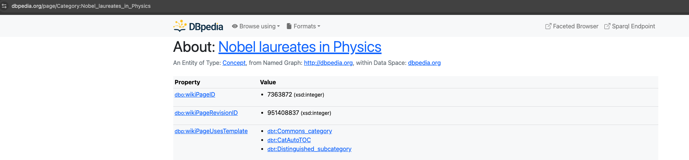 | 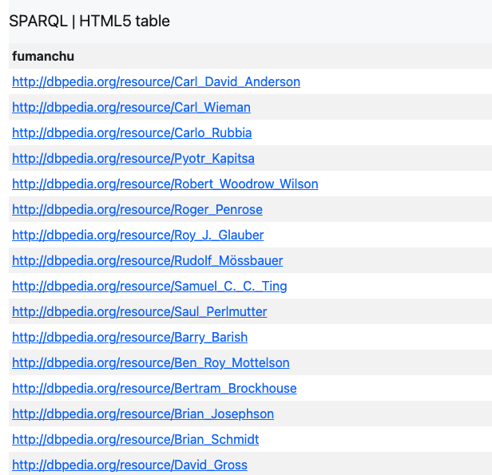 |

A subtle property of the result set: a single laureate can produce **multiple rows** because `dbo:birthPlace` may resolve to a city, a region, *and* a country independently (Einstein has 3 birthplace bindings: Ulm, Württemberg, German Empire). The OpenRefine integration step deduplicates by laureate using the join key.

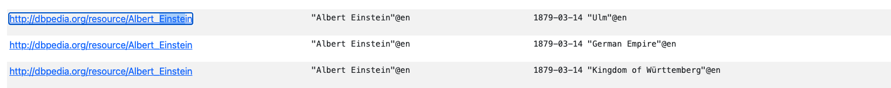

The CSV downloaded from the SPARQL editor is loaded into an OpenRefine project named `dbpedia_nobel_physics`:

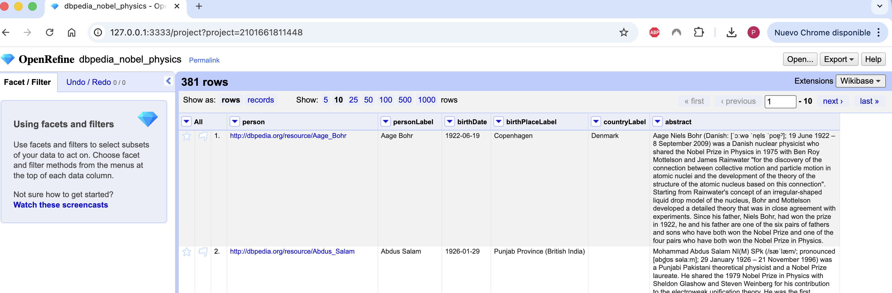

---

## Stage 2 — Acquisition from the Nobel Prize REST API

The Nobel Foundation maintains a versioned REST API (`/2.1/`). The relevant endpoint here is `GET /laureates?nobelPrizeCategory=phy`, which returns one JSON object per Physics laureate with all their prize-side metadata in a single payload.

Endpoint reference: [`api/nobel-laureates-endpoint.md`](api/nobel-laureates-endpoint.md).

| API documentation hub | Sample JSON response |
| :--- | :--- |
| 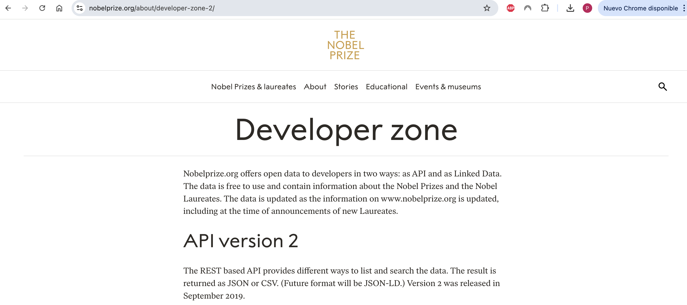 | 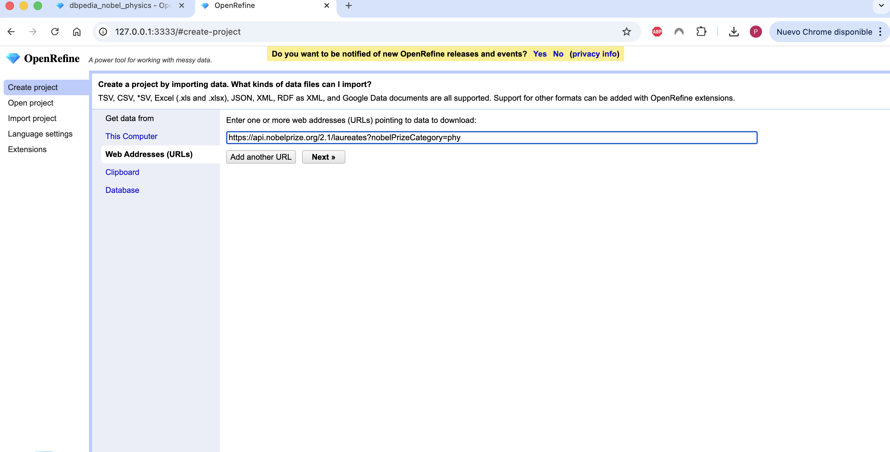 |

The JSON is loaded into a second OpenRefine project named `api_nobel_physics`. Both projects coexist in the same OpenRefine instance — that's the precondition for using `cross()` to bridge them later.

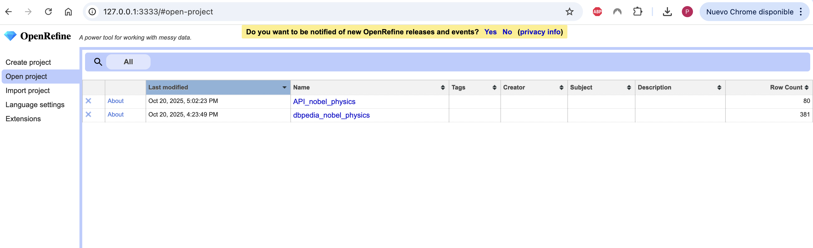

---

## Stage 3 — Cleaning and integration with GREL

Three groups of transformations, all catalogued in [`grel/README.md`](grel/README.md):

### 3.1 Build a stable `fullName`

The API exposes `fullName.en`, but it is missing for some laureates. We always reconstruct it from `givenName.en` + `familyName.en` so no record is dropped on missing data:

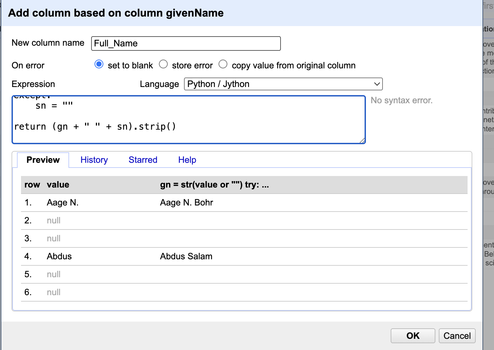

### 3.2 Build a normalised `join` key on both sides

The two sources spell names differently (DBpedia includes parenthesised qualifiers, the API uses middle initials, and so on). A naive equality join misses ~25% of the records. We build a deterministic key that survives those differences:

```grel
with(
  value.toLowercase()
       .replace(/\s*\([^)]*\)\s*/," ")          // drop "(physicist)"
       .replace(/[^A-Za-zÀ-ÿ\s]/,' ')           // drop punctuation/numbers
       .replace(/\s+/,' ').trim()
       .split(' '),
  t,
  ( if(t.length()>1, t[0] + ' ' + t[t.length()-1], t.join(' ')) )
    .fingerprint()                              // OpenRefine's clusterer key
)
```

Re-using OpenRefine's `fingerprint()` clusterer as the join key means the join is robust to the same kind of noise the cluster-and-merge UI was designed to handle.

### 3.3 Merge with `cross()`

`cross(value, "<other-project>", "<other-key-column>")` returns the rows on the other side that match the current key. We use it column by column to bring DBpedia's `birthDate`, `birthPlaceLabel`, `countryLabel`, `abstract` and `person` URI into the API project — that's where the deliverable lives:

```grel
with(
  cross(value, "dbpedia_nobel_physics", "join"),
  m,
  if(length(m) > 0, m[0].cells["birthDate"].value, null)
)
```

For laureates with multiple matches on the DBpedia side (because of the multi-row birthplace issue), the alternative aggregator pulls every distinct value:

```grel
forEach(m, r, r.cells["birthPlaceLabel"].value).uniques().join("; ")
```

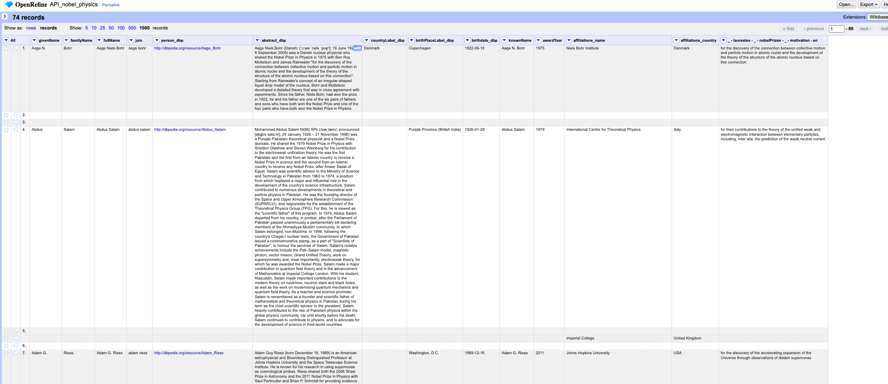

---

## Stage 4 — Reconciliation against Wikidata

OpenRefine's reconciliation service connects each row to a *real* entity in a target knowledge base. We point it at Wikidata's reconciliation API (`https://wikidata.reconci.link/en/api`) and constrain the type to **Q5** (`human`) so Wikidata won't mis-match a laureate to a fictional or organisational entity of the same name.

A second nudge to improve the match rate: add `birthDate_dbp` as a *property* in the reconciliation dialog so Wikidata can disambiguate using year of birth, not just the name string.

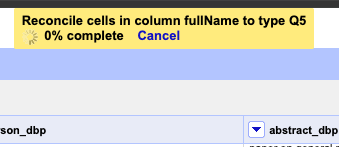

---

## Stage 5 — Enrichment with Wikidata properties

Once reconciled, every row carries a Wikidata QID (`Q937` for Einstein, etc.). OpenRefine's *Add columns from reconciled values* lets us pull arbitrary Wikidata properties for each laureate without writing more SPARQL by hand. The properties we add for the deliverable are:

- **`P69` — educated at**
- **`P108` — employer**
- **`P512` — academic degree**
- **`P166` — award received**
- **`P101` — field of work**
- **`P737` — influenced by**

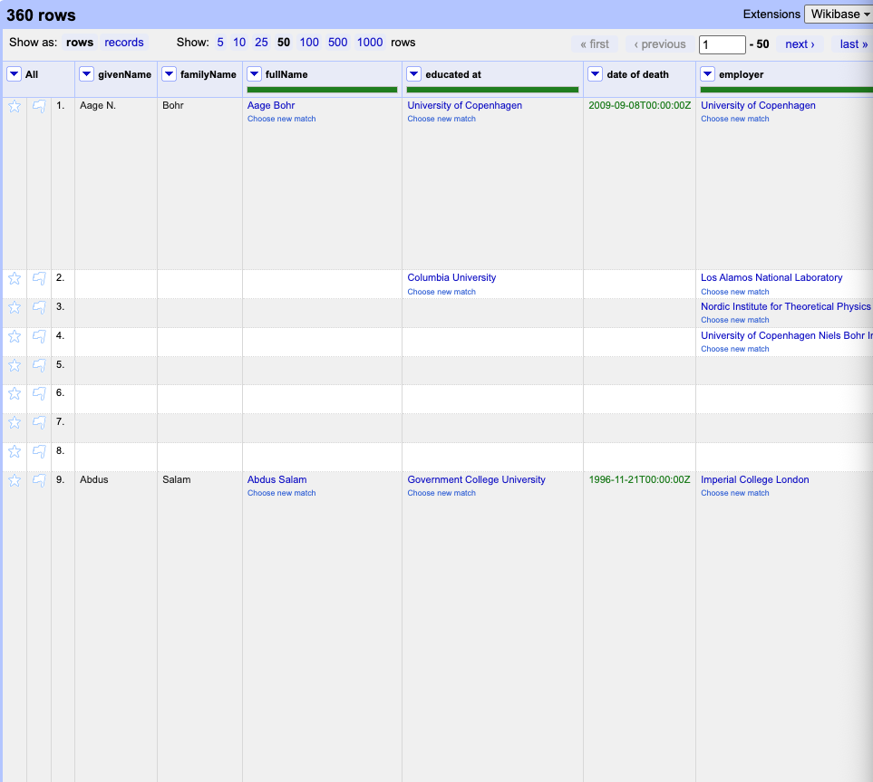

---

## Why this matters in a Fintech context

Linked Open Data is the underlying technology behind every legal-entity / instrument-reference data project that touches public knowledge graphs:

- **Counterparty identification.** Reconciling internal counterparties to a stable QID lets a bank join its proprietary data to public KYC, sanctions and ESG datasets without building bespoke ETL for each provider.
- **Instrument metadata enrichment.** ISIN-keyed proprietary feeds can be joined to DBpedia / Wikidata to recover issuer descriptions, sector classifications and historical events that price feeds don't carry.
- **Audit trail.** OpenRefine exports the full operation history as JSON. That history is replay-safe and human-readable, which is exactly the property compliance teams ask for when a data product feeds a regulated calculation.

The pipeline this project implements is the same shape you'd build for any of those — just with "Nobel laureates in Physics" instead of "FTSE 100 issuers" as the target population.

---

## Reproducing the pipeline

Out-of-the-box reproducibility is intentionally limited: DBpedia is a live service whose dump and schema evolve over time, the Nobel Prize API is rate-limited, and Wikidata's reconciliation result depends on the current snapshot of Wikidata itself. The dataset is therefore not committed.

To reproduce a run from scratch:

1. Open the SPARQL editor at <https://dbpedia.org/sparql>, paste [`sparql/main-nobel-laureates-physics.sparql`](sparql/main-nobel-laureates-physics.sparql), set *Results Format → CSV*, hit Run, save the file.
2. `curl 'https://api.nobelprize.org/2.1/laureates?nobelPrizeCategory=phy' > laureates.json`
3. Launch OpenRefine, create two projects: `dbpedia_nobel_physics` (from the CSV) and `api_nobel_physics` (from the JSON, descend to the `laureates` array).
4. Apply the GREL transformations under [`grel/`](grel/) in order, on the column they target.
5. Reconcile the `fullName` column against `https://wikidata.reconci.link/en/api`, type `Q5`.
6. *Add columns from reconciled values* and pick the six properties listed in **Stage 5**.
7. Export the project as `.xls` (data) and the operation history as `.json` (audit trail).

---

## Reference

Implementation of the **SPARQL / Linked Open Data practice** of *Big Data*, MU Tecnologías del Sector Financiero (UC3M, 2025/2026). The pipeline implements every phase of the data life-cycle (acquisition, cleaning, integration, reconciliation, enrichment) over a real LOD target, with reproducibility ensured through versioned SPARQL queries, GREL scripts and the OpenRefine operation history.
