# MongoDB Sharded Cluster — Docker

Hands-on **MongoDB sharding lab** built in two stages, on the same physical topology:

1. **Manual stage** — every node started by hand with `mongod`, replica sets initialised one by one with `rs.initiate()`, the cluster registered against the router with `sh.addShard()`, and three failure scenarios exercised against the live cluster. The point is to understand each moving part *before* hiding any of them behind orchestration.
2. **Compose stage** — the same topology packaged as a turnkey, repeatable `docker compose up`. A base file plus two overlays (`dev` for ports + ergonomics, `prod` for keyfile auth + isolation) make it explicit which knobs change between environments.

Both flows produce the **same end state**: a sharded cluster with two shards (`myRS1`, `myRS2`), each a 3-node replica set, plus a 3-node config-server replica set (`myCS`), plus a single `mongos` query router on port `27027`.

---

## Why both flows

The manual flow is the way you actually learn what sharding is — what an `rs.initiate` does, why `sh.addShard` is a separate step, what happens to writes when a shard's PRIMARY drops without a majority. None of that surfaces if Compose hides it.

The Compose flow is the way you *operate* it — every container restartable, every volume named, every secret bind-mounted, every environment difference contained in an overlay. It's the version that goes into infrastructure repos.

Both files reference the same screenshots from the original practice run, so a reviewer can see what each `mongosh` command produces without booting anything locally.

---

## Topology

| Component | Replica set | Member ports (manual) | Member hostname (compose) |
|---|---|---|---|
| Shard 1 | `myRS1` | 27018 / 27019 / 27020 | `shard1_1` / `shard1_2` / `shard1_3` |
| Shard 2 | `myRS2` | 27021 / 27022 / 27023 | `shard2_1` / `shard2_2` / `shard2_3` |
| Config server | `myCS` | 27024 / 27025 / 27026 | `config1` / `config2` / `config3` |
| Query router | — | `mongos` on 27027 | `mongos` on 27027 |

Total: **9 `mongod` processes + 1 `mongos`**.

---

## Tech stack

| Area | Choice |
|------|--------|
| Database | MongoDB 7.x |
| Replica sets | 3 × 3-node replica sets (2 shards + config) |
| Routing | `mongos` query router |
| Manual lab | Plain `mongod` / `mongosh`, host-network ports |
| Compose lab | Docker Compose 2.x, named volumes, override layering |
| Auth (prod overlay) | Replica-set keyfile + `--auth` |

---

## Project layout

```
mongodb-sharded-cluster-docker/
├── README.md
├── manual/
│   └── commands.md                  # full step-by-step manual flow
├── compose/
│   ├── docker-compose.yml           # base topology (mongos exposed on 27027)
│   ├── docker-compose.dev.yml       # dev overlay: every shard exposed on host
│   ├── docker-compose.prod.yml      # prod overlay: keyfile auth + isolation
│   └── init-cluster.sh              # rs.initiate + sh.addShard for compose
└── screenshots/                     # real outputs from the original run
```

---

## Stage 1 — Manual flow

Full walkthrough at [`manual/commands.md`](manual/commands.md). Highlights:

### Replica-set initialisation

After starting each `mongod` (one terminal per node), each replica set is initialised against its first member:

```js
rs.initiate({
  _id: "myRS1",
  members: [
    { _id: 0, host: "localhost:27018" },
    { _id: 1, host: "localhost:27019" },
    { _id: 2, host: "localhost:27020" }
  ]
})
rs.status()
```

The first node becomes `PRIMARY`, the other two `SECONDARY`. Same idiom for `myRS2` (shard 2) and `myCS` (config server, with `configsvr: true`).

| myRS1 — `rs.initiate()` | myRS1 — `rs.status()` showing PRIMARY at 27018 |
| :--- | :--- |
| 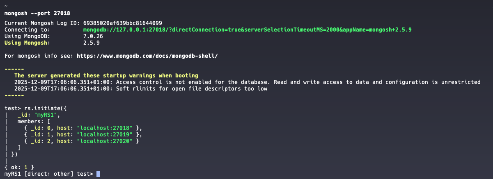 | 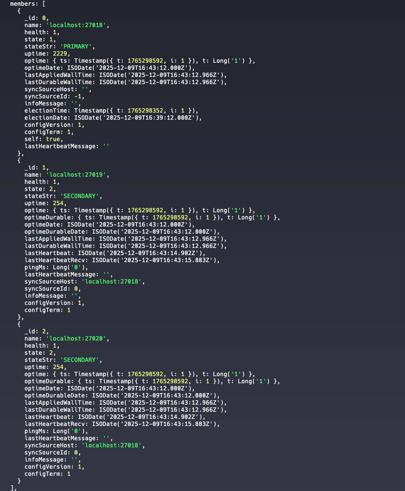 |

| myRS2 initiated | myCS — config-server replica set |
| :--- | :--- |
| 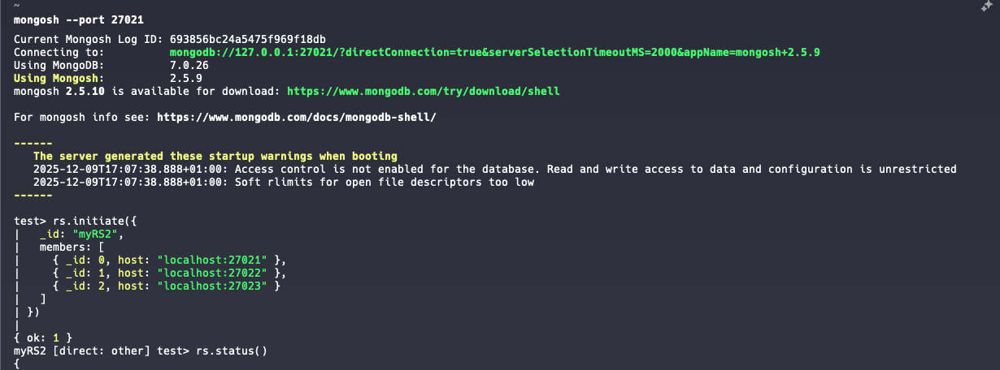 | 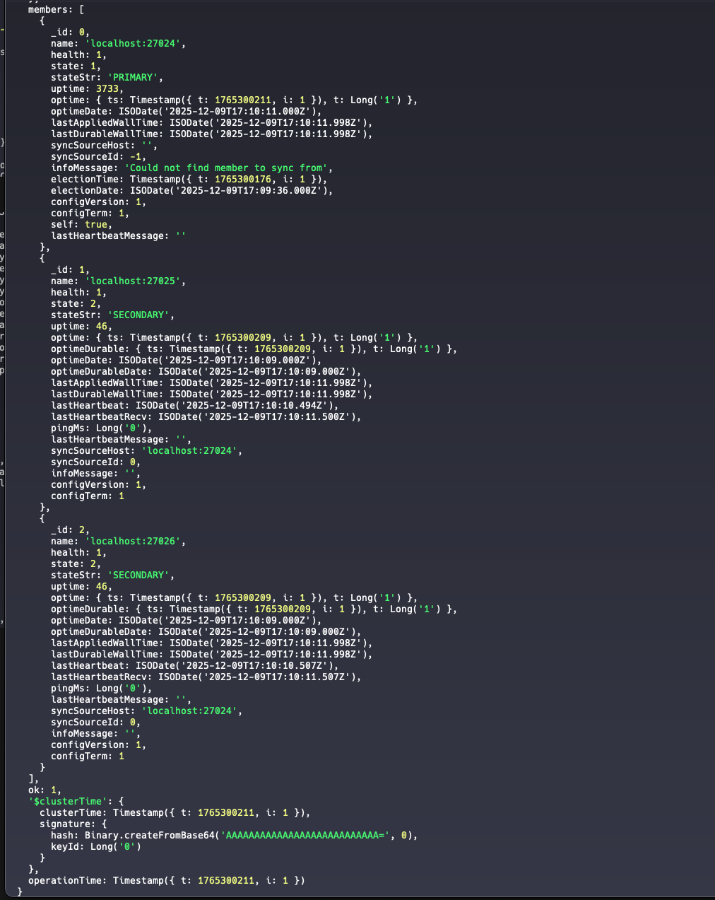 |

### Router and cluster registration

Once the replica sets are healthy, the `mongos` router is started and pointed at the config-server replica set. Each shard is then registered with `sh.addShard`:

```js
sh.addShard("myRS1/localhost:27018,localhost:27019,localhost:27020")
sh.addShard("myRS2/localhost:27021,localhost:27022,localhost:27023")
sh.status()
```

| `mongos` started | Both shards registered (`state: 1`) |
| :--- | :--- |
| 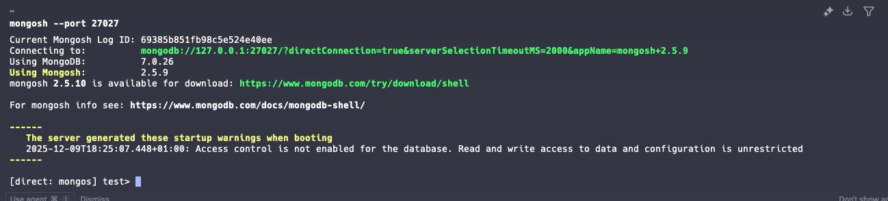 | 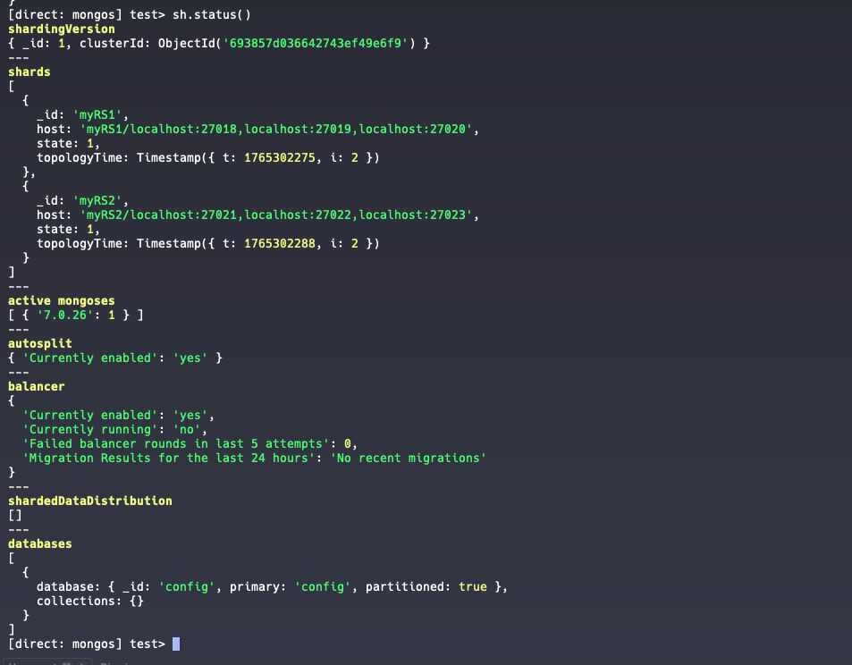 |

### Sharding a collection by range key

The `tiny.coffee` collection is sharded by a range key on `Address.Country`, then 1,287 documents are imported through the router with `mongoimport`:

```js
sh.enableSharding("tiny")
sh.shardCollection("tiny.coffee", { "Address.Country": 1 })
```

| `sh.shardCollection` returns `ok:1` | 1,287 documents imported |
| :--- | :--- |
| 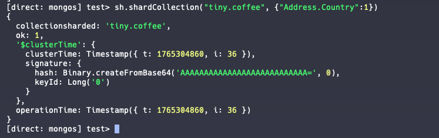 | 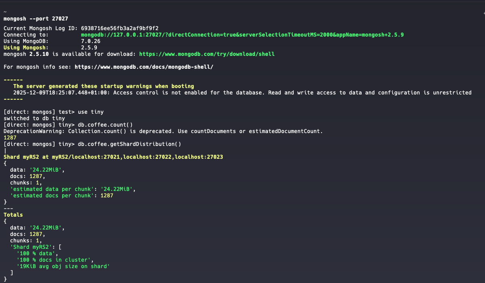 |

The whole dataset weighs ~24 MB, comfortably below MongoDB's default 64 MB chunk size, so all the documents stay in a single chunk on the primary shard for `tiny` (in this run, `myRS2`). No splits, no balancing — exactly what is expected at this scale. Splits would kick in only once a chunk exceeded the threshold.

| Sample query — Spain documents |
| :--- |
| 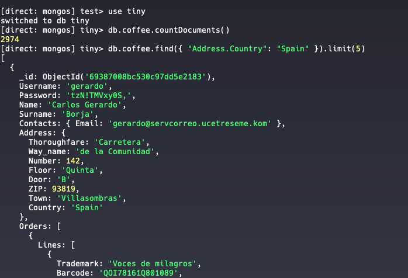 |

### Failure scenarios

The interesting part of the manual flow: three deliberate failures, each with a different recovery characteristic.

#### Case 1 — A SECONDARY drops

`Ctrl+C` one of the SECONDARY nodes. `rs.status()` reports it as `(not reachable/healthy)`. The cluster still has a quorum (2 of 3) on that shard, so reads and writes through `mongos` keep working.

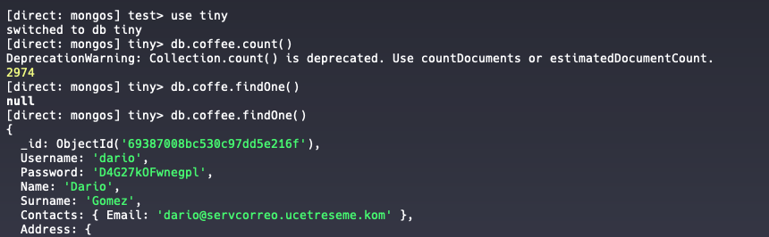

#### Case 2 — PRIMARY drops without a majority

Stop the PRIMARY *and* a SECONDARY in the same shard, leaving only one node alive. With 1 of 3 < 2 of 3, no node can be elected — replica sets refuse to promote a survivor without majority, by design, to prevent split-brain. **No new PRIMARY emerges, no writes are accepted, default reads against that shard fail.**

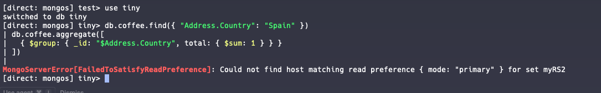

#### Case 3 — PRIMARY drops with a majority

Bring the third node back so two healthy nodes remain. Now stop the current PRIMARY. Two survivors form a majority, and one of them is automatically promoted to PRIMARY through the standard election protocol; writes resume on the new PRIMARY.

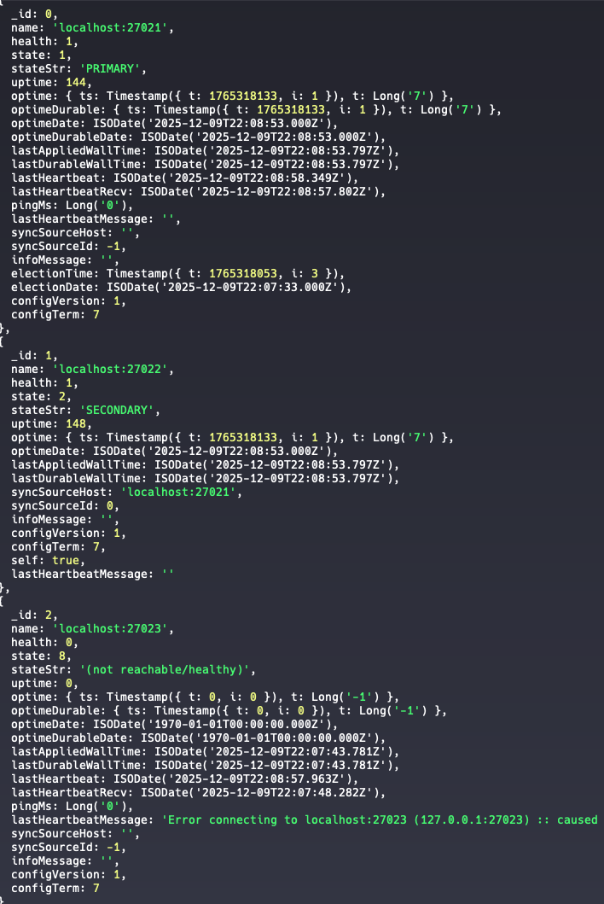

The takeaway in plain trade-off terms: a 3-node replica set tolerates the loss of 1 node but not 2 — the second loss costs availability *deliberately*, in exchange for never accepting a partitioned write.

---

## Stage 2 — Docker Compose flow

Three files, each with one responsibility:

- **`docker-compose.yml`** — the base topology. 9 `mongod` containers + 1 `mongos`, all on a private bridge network `mongo-net`, talking to each other by container hostname. Only the `mongos` is exposed externally (host port `27027`). Volumes are declared and named so data persists across `docker compose down`.
- **`docker-compose.dev.yml`** — overlay for local hacking. Every shard and config server is also exposed on its own host port (27018-27026), matching the manual layout, so `mongosh --port 27021` works against the real shard 2 PRIMARY just like in `manual/commands.md`.
- **`docker-compose.prod.yml`** — overlay for production-style isolation. Keeps shards & config servers off the host network, enables replica-set keyfile authentication (`--keyFile` + `--auth`), pins WiredTiger cache sizes, and only the router is reachable.

```bash
# Dev: bring everything up, every node port-mapped to the host
docker compose -f compose/docker-compose.yml \
               -f compose/docker-compose.dev.yml up -d

# Initialise the replica sets and register both shards (one-off)
./compose/init-cluster.sh

# Prod-style: keyfile auth, only mongos reachable from the host
docker compose -f compose/docker-compose.yml \
               -f compose/docker-compose.prod.yml up -d
```

The prod overlay expects a keyfile at `compose/secrets/mongo-keyfile`. Create it once with:

```bash
mkdir -p compose/secrets
openssl rand -base64 756 > compose/secrets/mongo-keyfile
chmod 400 compose/secrets/mongo-keyfile
```

`init-cluster.sh` is idempotent in spirit but not in implementation — running it twice will fail on `rs.initiate` because the replica sets already exist. That's fine for the lab; in a real deployment, replica-set bootstrap is a one-shot operation anyway.

### What the compose flow does NOT change

The semantics of replica-set elections, quorum and split-brain prevention are identical to the manual flow — those live inside `mongod`, not in the orchestration layer. A `docker compose stop shard2_1` is the equivalent of `Ctrl+C` on the manual PRIMARY of `myRS2`; the surviving members go through exactly the same election logic.

That's the design point of this project: the compose layer only changes *how* you start the processes and bind their ports. The cluster's behaviour is the same in both stages, which is why the screenshots from the manual run document the compose run as well.

---

## Reference

Implementation of the **MongoDB sharding practice** of *Big Data*, MU Tecnologías del Sector Financiero (UC3M, 2025/2026). The manual walkthrough faithfully reproduces every step the original practice required (replica-set bootstrap, shard registration, range-based shard key, bulk import, three failure scenarios). The Compose evolution wraps the same topology in a reproducible, environment-aware deployment.
