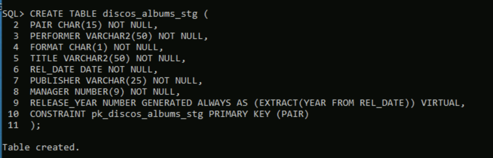
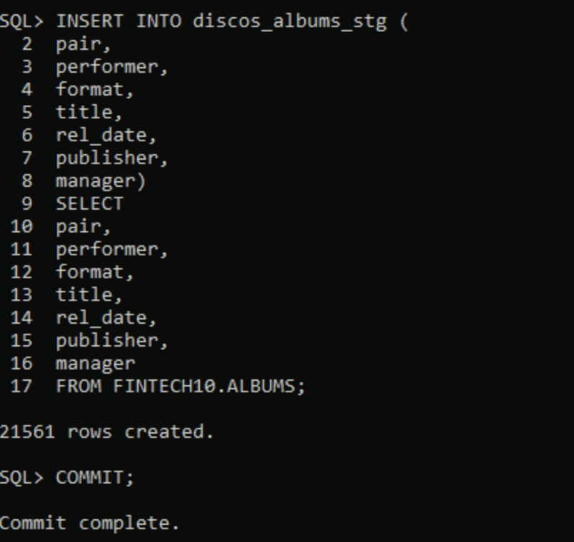
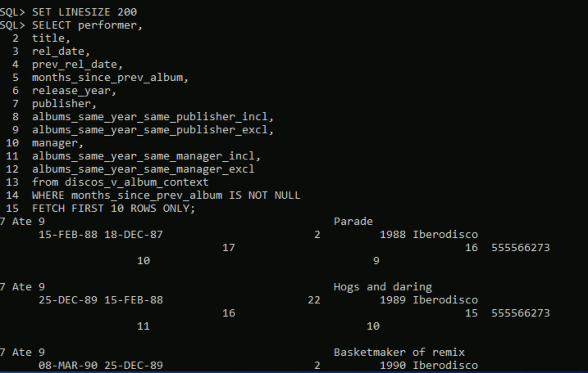
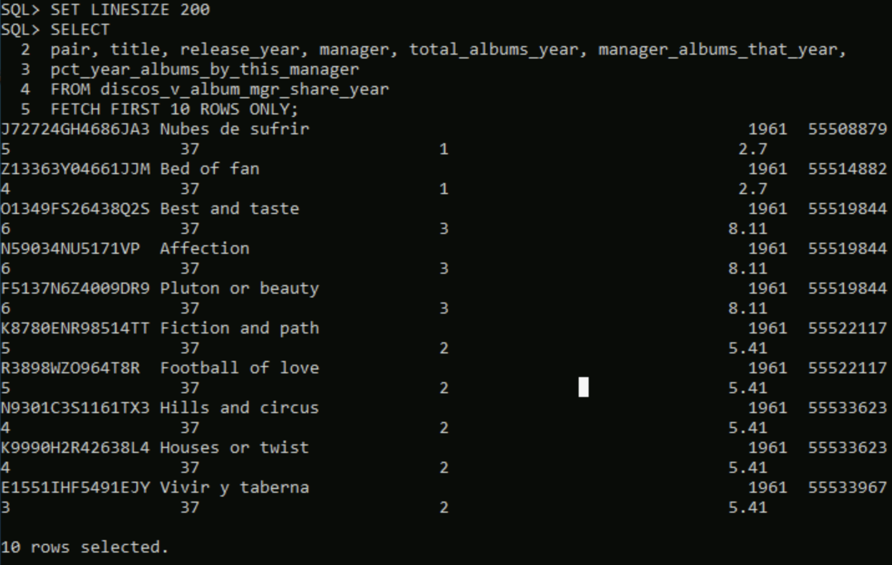
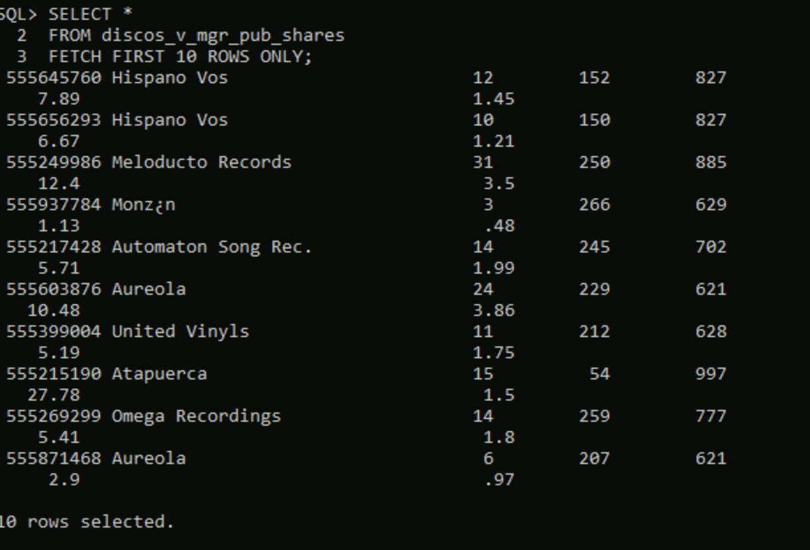
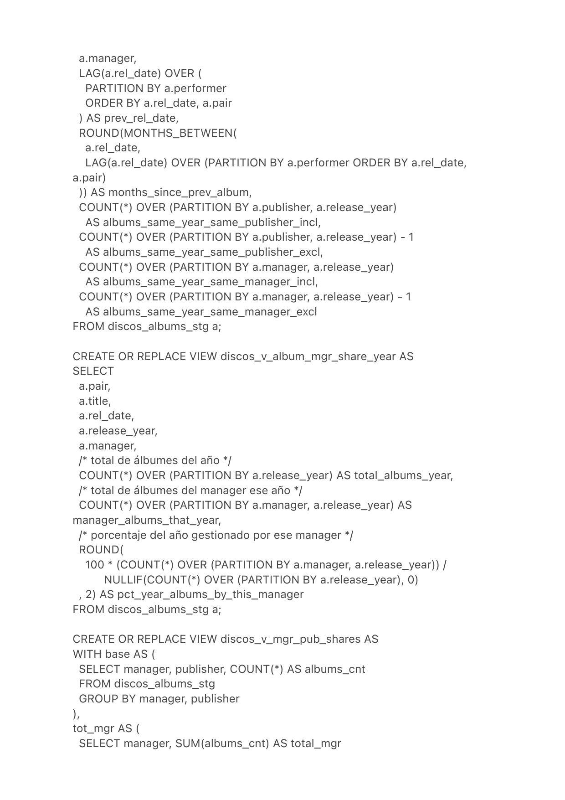

# Oracle Music Data Warehouse — Analytical Views over `discos_albums_stg`

A focused **data-warehousing exercise on Oracle**: build a thin staging layer over a 21,561-row source table of music albums, and expose a small *almacén* (warehouse) of analytical **views** on top of it. The views answer four business questions that recur in label-management analytics — release cadence per artist, manager market share by year, manager↔publisher cross-share, and album/recording context per performer — using window functions, CTEs and correlated subqueries.

The point of the exercise is **not** to dump SQL — it's to model the layering correctly: source table (untouched) → staging (clean copy + virtual columns) → views (pure logic, no duplicated state).

---

## Tech stack

| Area | Choice |
|------|--------|
| Database | Oracle Database 12c (12.x or newer) |
| SQL features | Window functions (`LAG`, `COUNT() OVER`), `MONTHS_BETWEEN`, virtual columns (`GENERATED ALWAYS AS … VIRTUAL`), CTEs (`WITH`), correlated subqueries, `NULLIF` |

---

## Architecture

```
            FINTECH10.ALBUMS                 -> upstream production table (untouched)
                  |
                  | INSERT INTO ... SELECT
                  v
        discos_albums_stg (21,561 rows)      -> staging copy + RELEASE_YEAR (virtual)
                  |
                  v
   "almacén discos" (a set of views)
   ├── discos_v_album_context                -> release cadence per artist
   ├── discos_v_album_mgr_share_year         -> manager share of yearly publications
   ├── discos_v_mgr_pub_shares               -> manager↔publisher cross-share
   └── discos_v_album_tracks_info            -> tracks per album + cumulative recordings
```

The warehouse — `almacén discos` — is **not** a separate physical database. It's just the four views above, all computed live on the staging table. That keeps the design boring and reproducible: no ETL state, no pipelines, no scheduled refresh; if the staging table changes, the views reflect it on the next read.

---

## Project layout

```
oracle-music-data-warehouse/
├── screenshots/
│   ├── 01-staging-create-table.png
│   ├── 02-staging-insert-21561-rows.png
│   ├── 03-view-album-context-output.png
│   ├── 04-view-mgr-share-year-output.png
│   ├── 05-view-mgr-pub-shares-output.png
│   └── 06-view-album-tracks-info-output.png
└── sql/
    ├── staging/
    │   └── 01-discos-albums-stg.sql
    └── views/
        ├── 01-discos-v-album-context.sql
        ├── 02-discos-v-album-mgr-share-year.sql
        ├── 03-discos-v-mgr-pub-shares.sql
        └── 04-discos-v-album-tracks-info.sql
```

---

## Staging layer

[`sql/staging/01-discos-albums-stg.sql`](sql/staging/01-discos-albums-stg.sql) builds `discos_albums_stg` with the same columns as `FINTECH10.ALBUMS` plus a **virtual column** for the release year:

```sql
release_year NUMBER GENERATED ALWAYS AS (EXTRACT(YEAR FROM rel_date)) VIRTUAL
```

The virtual column matters because every analytical view partitions or groups by year, and storing it as `VIRTUAL` keeps it always consistent with `rel_date` (it cannot be set independently) without duplicating bytes on disk. It can also be indexed if needed.

| Staging step | Screenshot |
| :--- | :--- |
| `CREATE TABLE discos_albums_stg` |  |
| `INSERT … SELECT FROM FINTECH10.ALBUMS` (21,561 rows) |  |

---

## View 1 — `discos_v_album_context`

**Question.** For every album, surface the release cadence of its artist and the volume of activity around it the same year.

**Mechanics.** `LAG(rel_date) OVER (PARTITION BY performer ORDER BY rel_date, pair)` recovers the previous album's date for the same artist; `MONTHS_BETWEEN` then gives the gap. `COUNT(*) OVER (PARTITION BY publisher, release_year)` and the equivalent on `manager` give the inclusive ("includes the current album") and exclusive variants of "how many albums did the same publisher / manager release that year".

```sql
LAG(a.rel_date) OVER (
    PARTITION BY a.performer
    ORDER BY a.rel_date, a.pair
) AS prev_rel_date,

ROUND(MONTHS_BETWEEN(
    a.rel_date,
    LAG(a.rel_date) OVER (PARTITION BY a.performer ORDER BY a.rel_date, a.pair)
)) AS months_since_prev_album,

COUNT(*) OVER (PARTITION BY a.publisher, a.release_year)
    AS albums_same_year_same_publisher_incl,
COUNT(*) OVER (PARTITION BY a.publisher, a.release_year) - 1
    AS albums_same_year_same_publisher_excl,
...
```

**Reading the output (sample row).** Performer "7 Ate 9", album *Parade*, released 1988-02-15. Its previous album dates from 1987-12-18 — that's roughly **2 months apart**. In 1988 the publisher *Iberodisco* released **17** albums in total (or 16 excluding *Parade*); the same year, manager `5555666273` managed **10** albums (or 9 excluding *Parade*).



The full SQL with comments is in [`sql/views/01-discos-v-album-context.sql`](sql/views/01-discos-v-album-context.sql).

---

## View 2 — `discos_v_album_mgr_share_year`

**Question.** For every album, what percentage of albums released that same year were managed by the same manager?

**Mechanics.** Two co-existing window aggregates: `COUNT(*) OVER (PARTITION BY release_year)` for the year total, `COUNT(*) OVER (PARTITION BY manager, release_year)` for the manager's share, divided and rounded. `NULLIF(...,0)` is defensive against an empty staging.

```sql
ROUND(
    100 * (COUNT(*) OVER (PARTITION BY a.manager, a.release_year))
        / NULLIF(COUNT(*) OVER (PARTITION BY a.release_year), 0)
, 2) AS pct_year_albums_by_this_manager
```

**Reading the output (sample row).** In 1961 there were **37 albums** released in total. Album *Nubes de sufrir*, managed by manager `55508879`, accounts for **2.7%** of the year (1/37). Album *Best and taste*, managed by manager `55519844`, accounts for **8.11%** of the year (3/37, since that manager produced three of the 37 albums that year).



Source: [`sql/views/02-discos-v-album-mgr-share-year.sql`](sql/views/02-discos-v-album-mgr-share-year.sql).

---

## View 3 — `discos_v_mgr_pub_shares`

**Question.** For every (manager, publisher) pair, what is the bilateral share of activity? That is — what percentage of the manager's catalogue does this publisher produce, *and* what percentage of the publisher's catalogue does this manager manage?

**Mechanics.** Three CTEs:

1. `base` — count of albums per (manager, publisher) pair.
2. `tot_mgr` — total albums per manager (sum over base).
3. `tot_pub` — total albums per publisher (sum over base).

The two totals are joined back to base; both percentages are computed with the same `albums_cnt` numerator and a different denominator.

**Reading the output (sample row).** Manager `555645760` and publisher *Hispano Vos*: they have produced **12 albums together**. The manager has **152 albums** total across all labels, so that 12 is **7.89%** of his/her catalogue. *Hispano Vos* has **827 albums** total across all managers, so that same 12 is just **1.45%** of the label's catalogue. Both numbers are correct simultaneously — they describe the same relationship from each side.



Source: [`sql/views/03-discos-v-mgr-pub-shares.sql`](sql/views/03-discos-v-mgr-pub-shares.sql).

---

## View 4 — `discos_v_album_tracks_info`

**Question.** For every album, the title, release date, number of tracks it contains, and the cumulative number of recordings the same performer had made by the album's release date.

**Mechanics.** The tracks count is a CTE pre-aggregation (`tracks_by_album`); a `LEFT JOIN` plus `NVL(.., 0)` lets albums with no tracks resolve to a clean zero.

The cumulative-recordings count is a **correlated subquery**: for every row of the outer staging it counts every track ever recorded by the same performer with `rec_date <= a.rel_date`. Because `TRACKS` does not store performer directly, the correlation routes through `discos_albums_stg` to recover the performer per track via its parent album.

```sql
(
    SELECT COUNT(*)
    FROM   FINTECH10.tracks t
    JOIN   discos_albums_stg ax ON ax.pair = t.pair
    WHERE  ax.performer = a.performer
      AND  t.rec_date  <= a.rel_date
) AS performer_recordings_upto_album_date
```



Reading the output: each row gives an album with its track count and the running total of recordings for the performer up to that album's date. Both numbers grow monotonically across an artist's discography, which is the sanity check that the recursion through `tracks → discos_albums_stg → performer` is wired correctly.

Source: [`sql/views/04-discos-v-album-tracks-info.sql`](sql/views/04-discos-v-album-tracks-info.sql).

---

## How to run

The scripts assume the canonical UC3M `FINTECH10.ALBUMS` and `FINTECH10.TRACKS` are accessible from the running schema. Once connected to Oracle:

```bash
sqlplus user/password@instance

SQL> SET LINESIZE 200
SQL> @sql/staging/01-discos-albums-stg.sql

SQL> @sql/views/01-discos-v-album-context.sql
SQL> @sql/views/02-discos-v-album-mgr-share-year.sql
SQL> @sql/views/03-discos-v-mgr-pub-shares.sql
SQL> @sql/views/04-discos-v-album-tracks-info.sql

SQL> -- and now query any view:
SQL> SELECT * FROM discos_v_album_mgr_share_year FETCH FIRST 10 ROWS ONLY;
```

---

## Reference

Built in the context of the *Big Data* module, MSc in Financial Sector Technologies (UC3M, 2025/2026).
