# Oracle SQL — Melomaniacs Concert-Management DB

End-to-end SQL exercise on a non-trivial relational schema: a **concert-management database** ("Melomaniacs") covering clients, attendances, performers, musicians, bands, songs, performances, concerts, tours, albums, tracks, studios, publishers and managers — twelve tables linked by ten different referential paths.

The project has **two parts**:

1. **Part 1 — Relational design + DDL.** A separate, smaller domain (a floristry catalogue) used as a vehicle to apply Oracle DDL constraints: composite primary keys, multi-column `UNIQUE`, semantic `CHECK`s (year-bound dates, non-negative prices), self-referencing `FOREIGN KEY` with `ON DELETE SET NULL`, and `ON DELETE CASCADE` for owning relations.
2. **Part 2 — Ten advanced SQL queries** over the Melomaniacs schema, designed to exercise the Oracle 12c+ feature set: `NOT EXISTS`, double `NOT EXISTS`, self-joins on temporal intervals, correlated subqueries, multi-CTE aggregations, `FETCH FIRST … ROWS WITH TIES`, `LIKE` over uppercased columns, `DATE` arithmetic for ages, `HAVING COUNT(DISTINCT …)` for loyalty filters, plus a bonus track on tour-name vs album-title matching.

The schema, the original statement, the relational graph and a step-by-step walkthrough of every query (with screenshots of the output on real data) live in [`docs/`](docs/) and [`screenshots/`](screenshots/).

---

## Tech stack

| Area | Choice |
|------|--------|
| Database | Oracle Database 12c (Release 12.x or newer) |
| Dialect | Oracle SQL — including 12c-only features (`FETCH FIRST … ROWS WITH TIES`) |
| Tooling | SQL*Plus / SQL Developer for execution |

---

## Project layout

```
oracle-sql-melomaniacs-concert-db/
├── docs/
│   └── relational-graph.pdf         # Schema graph for the Melomaniacs DB
├── screenshots/
│   ├── melomaniacs-relational-graph.png
│   ├── 01-floristry-ddl.png         # Part 1 — DDL execution
│   ├── 02-q1-no-mobile.png  ...     # Part 2 — one screenshot per query
│   └── 12-bonus-tours.png
└── sql/
    ├── ddl/
    │   └── 01-floristry-schema.sql
    └── queries/
        ├── q01-no-mobile.sql
        ├── q02-concert-site.sql
        ├── q03-isla-studios.sql
        ├── q04-tatos-band.sql
        ├── q05-cervantes-vinyls.sql
        ├── q06-redundancy.sql
        ├── q07-wan-the-man.sql
        ├── q08-new-age.sql
        ├── q09-loyalty-card.sql
        ├── q10-chartmaster.sql
        └── bonus-tours-not-promotional.sql
```

Every `.sql` file is self-contained: header docblock with the question + notes, the SQL itself, and (where useful) a sanity-check query commented out at the bottom.

---

## Part 1 — Floristry DDL

The floristry domain models bouquets (`RAMOS`), the flowers that compose them (`FLORES`), and the many-to-many composition table (`RACIMOS`). Three Oracle DDL features are exercised in [`sql/ddl/01-floristry-schema.sql`](sql/ddl/01-floristry-schema.sql):

- **Self-referencing FK with `ON DELETE SET NULL`** on `FLORES.flor_sustituta` → if a flower disappears, the substitute pointer on dependants becomes `NULL` rather than blocking the delete.
- **Owning FK with `ON DELETE CASCADE`** on `RACIMOS.ramo` → removing a bouquet removes its composition rows automatically. The other FK in the same table (`RACIMOS.flor`) is intentionally *not* cascading, so a flower belonging to any composition cannot be deleted directly.
- **Multi-column `CHECK`** on `RAMOS` enforcing `disponible_desde < disponible_hasta` AND that both fall in the same year, expressed via `EXTRACT(YEAR FROM …)`.
- **Token-set `CHECK`** on `FLORES.temporada` restricted to `('P','V','O','I')` so the season can be stored as a single character without losing its semantic guarantees.

One semantic rule (the bouquet's price must exceed the sum of its component flowers' unit costs × units) cannot be expressed in pure DDL because it spans three tables and depends on aggregated values; the file documents that limitation.

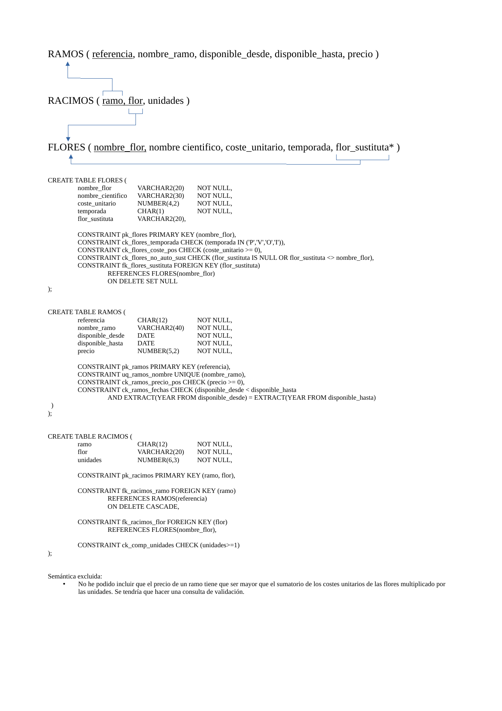

---

## Part 2 — Ten queries over Melomaniacs

The Melomaniacs schema is summarised below — full graph in [`docs/relational-graph.pdf`](docs/relational-graph.pdf).

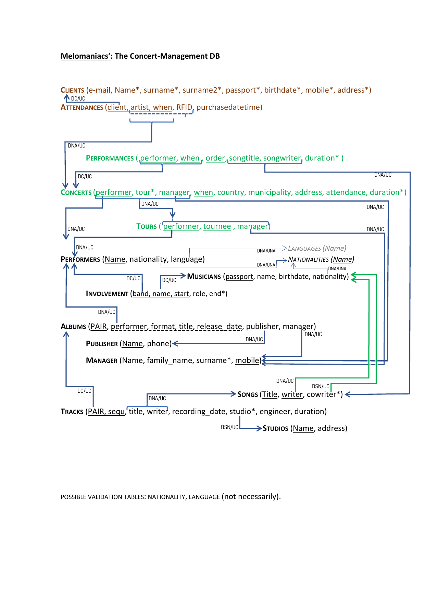

The table below maps each query to the SQL feature it stresses, the file containing the solution, and the screenshot that captures its output on the real dataset.

| # | Query | Feature exercised | File | Output |
|---:|---|---|---|---|
| 1 | **No mobile** — clients without mobile phone | `IS NULL` predicate, basic projection | [`q01-no-mobile.sql`](sql/queries/q01-no-mobile.sql) | 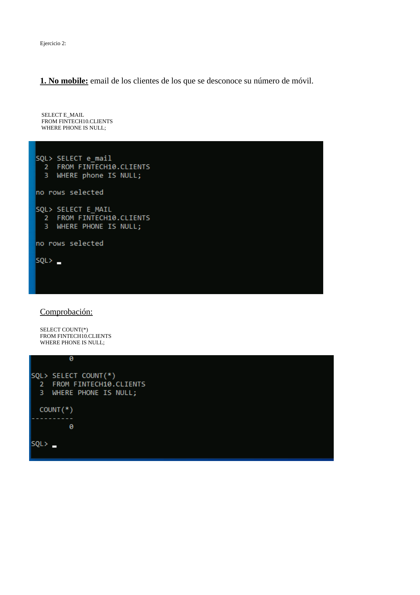 |
| 2 | **Concert-site** — municipalities with > 20 concerts in 2010-19 | `GROUP BY` + `HAVING COUNT(*) > N`, half-open date range | [`q02-concert-site.sql`](sql/queries/q02-concert-site.sql) | 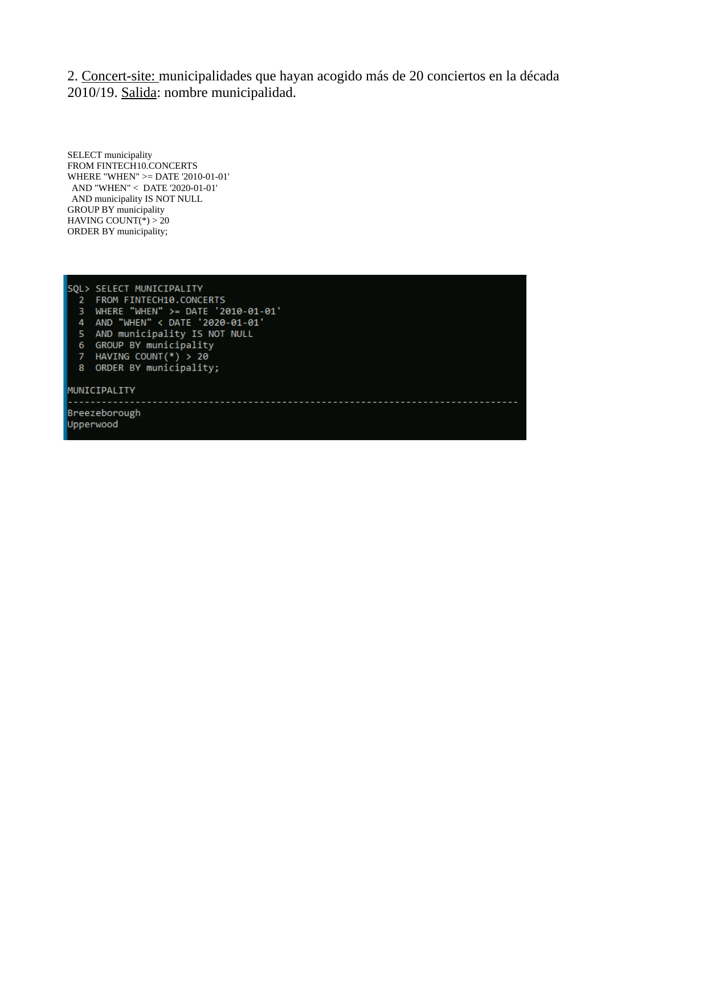 |
| 3 | **Estudios aislados** — studios on islands by address | Case-insensitive `LIKE` over `UPPER()` | [`q03-isla-studios.sql`](sql/queries/q03-isla-studios.sql) | 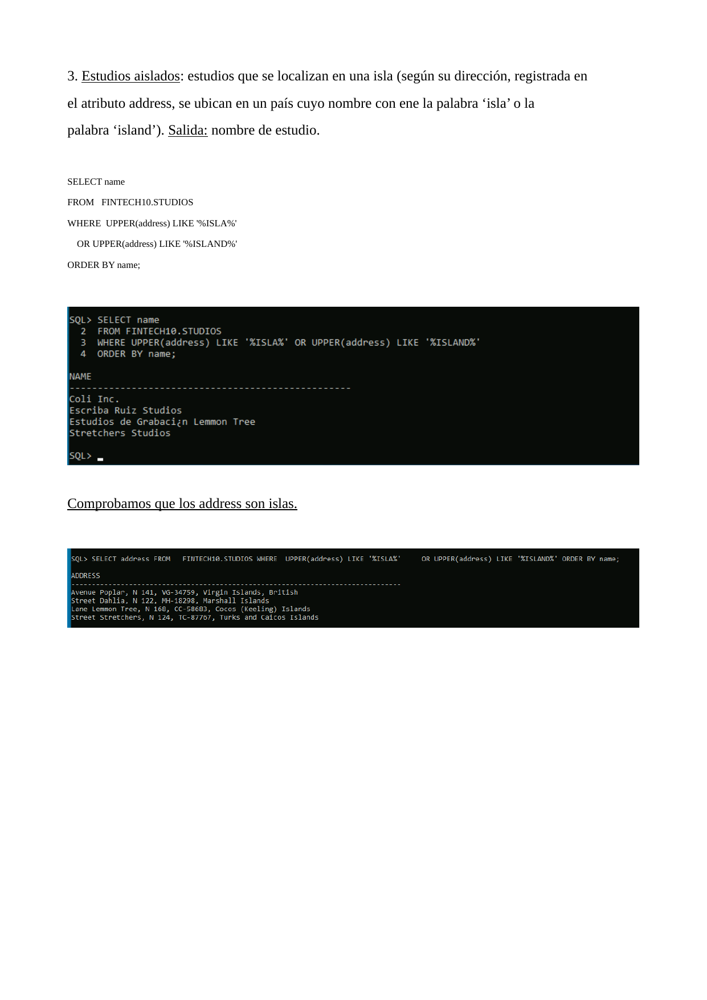 |
| 4 | **Tato's band** — bands with no currently active members | `EXISTS` + `NOT EXISTS` against open-ended intervals (`end_d IS NULL`) | [`q04-tatos-band.sql`](sql/queries/q04-tatos-band.sql) | 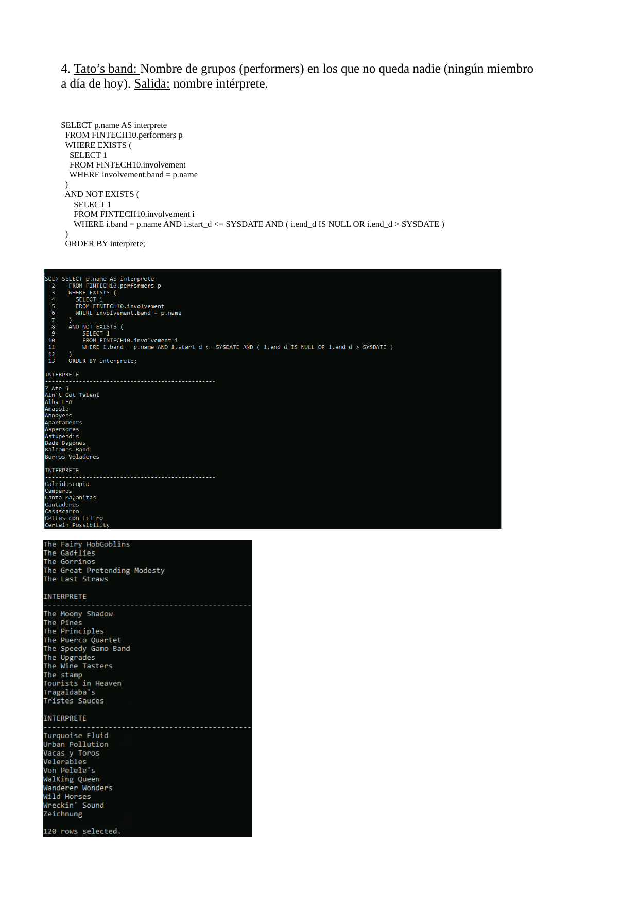 |
| 5 | **Cervantes vinyls** — vinyl albums with at least one track recorded at Cervantes Recordings | Join + `COUNT(DISTINCT)` to collapse multiplicity | [`q05-cervantes-vinyls.sql`](sql/queries/q05-cervantes-vinyls.sql) | 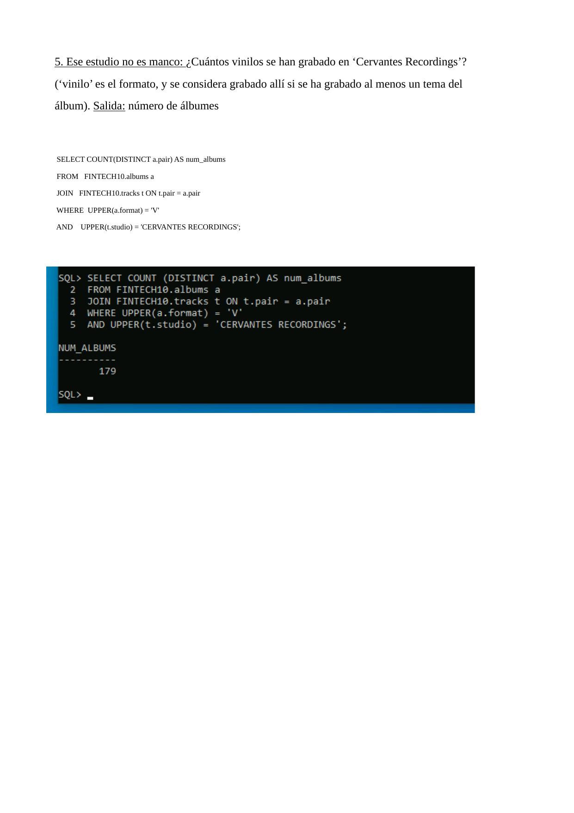 |
| 6 | **Redundancy** — bands with two contemporary members on the same instrument | Self-join on temporal interval overlap | [`q06-redundancy.sql`](sql/queries/q06-redundancy.sql) | 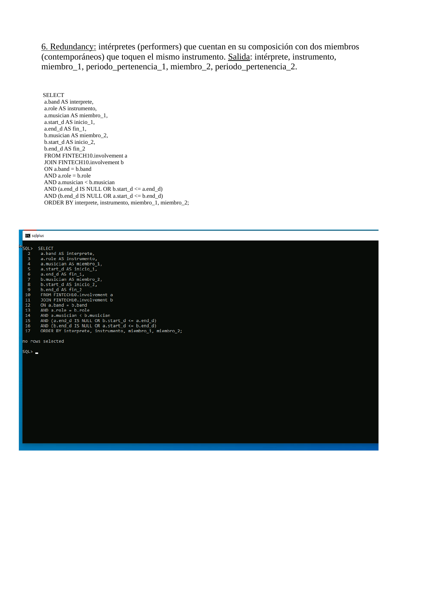 |
| 7 | **Wan the Man** — managers who only manage albums, never tours/concerts | Double `NOT EXISTS` + multi-aggregate `COUNT(DISTINCT)` | [`q07-wan-the-man.sql`](sql/queries/q07-wan-the-man.sql) | 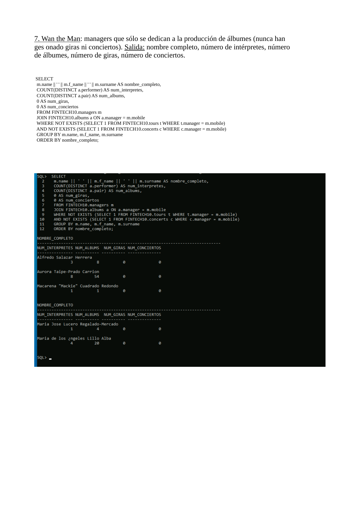 |
| 8 | **New-Age** — performers younger on average than their audience | Two CTEs computing means via `DATE` arithmetic, joined on performer | [`q08-new-age.sql`](sql/queries/q08-new-age.sql) | 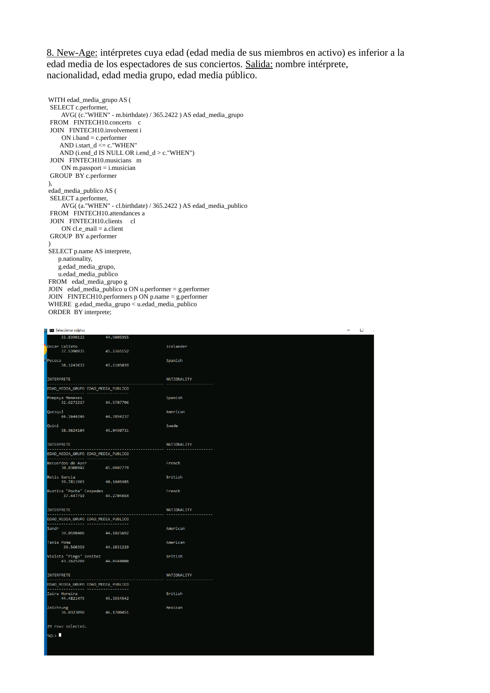 |
| 9 | **Loyalty-card** — clients attending the most concerts but always of the same band | CTE + `HAVING COUNT(DISTINCT)` + scalar subquery for max | [`q09-loyalty-card.sql`](sql/queries/q09-loyalty-card.sql) | 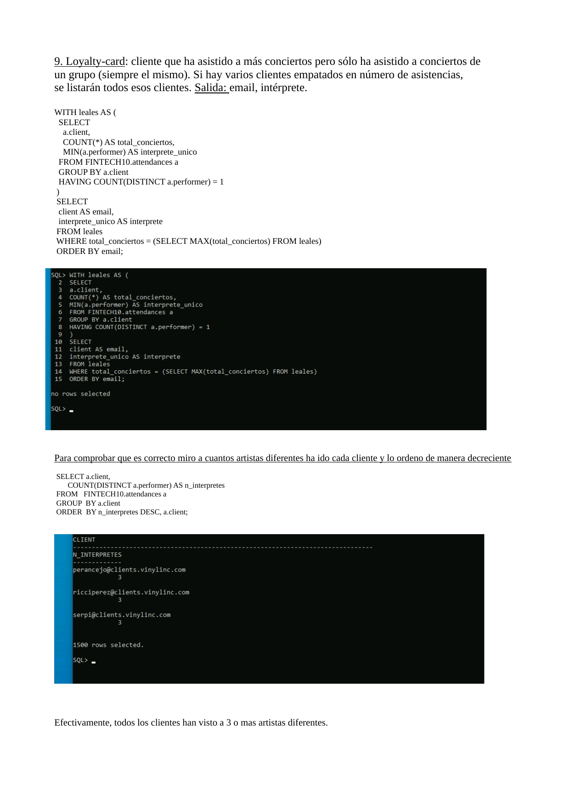 |
| 10 | **Top-5 ChartMaster** — top 5 musicians by their songs played in concerts | Two CTEs + `FETCH FIRST 5 ROWS WITH TIES` | [`q10-chartmaster.sql`](sql/queries/q10-chartmaster.sql) | 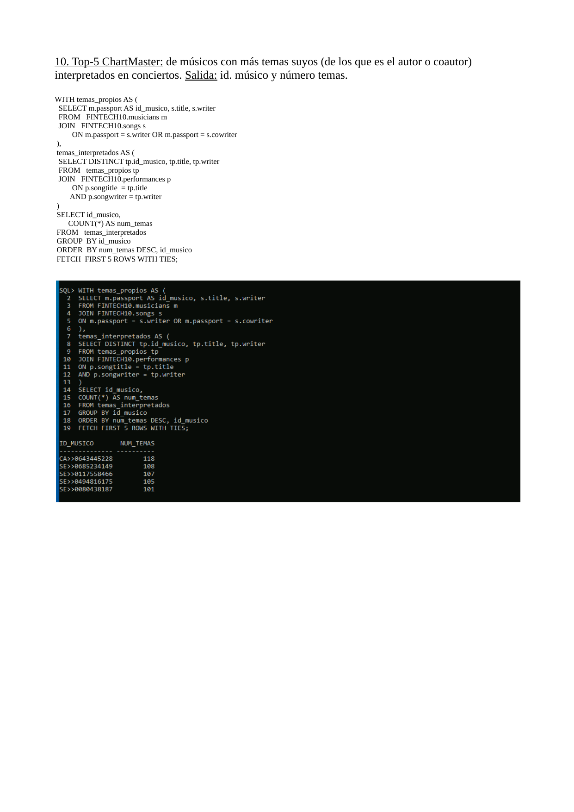 |
| Bonus | **Tours not promotional** — tours whose name does not contain any of the performer's album titles | `NOT EXISTS` with concatenated `LIKE` pattern | [`bonus-tours-not-promotional.sql`](sql/queries/bonus-tours-not-promotional.sql) | 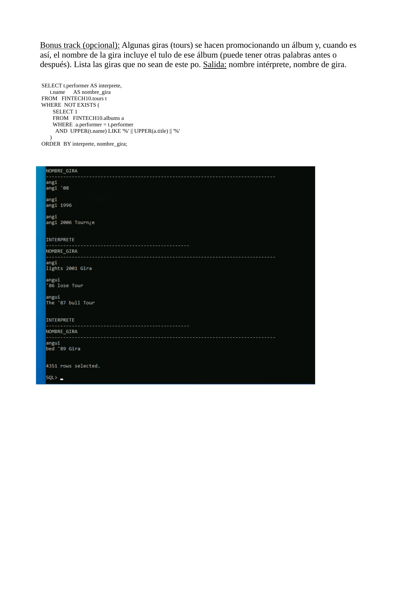 |

### Worked example — Q6 "Redundancy"

The most subtle query is the contemporary-members one. The natural-language predicate is *"a band has two members on the same role at the same time"*. Translating "at the same time" into SQL means **detecting interval overlap** between two membership ranges — and accounting for **open-ended ranges** where `end_d IS NULL`.

The interval-overlap rule is:

> Two intervals `[a.start_d, a.end_d]` and `[b.start_d, b.end_d]` overlap iff
> `a.start_d <= b.end_d` AND `b.start_d <= a.end_d`.

When `end_d IS NULL`, the interval is open-ended on the right; treating that as "+infinity" gives:

```sql
JOIN FINTECH10.involvement b
  ON a.band     = b.band
 AND a.role     = b.role
 AND a.musician < b.musician                            -- avoid duplicates / self
 AND (a.end_d IS NULL OR b.start_d <= a.end_d)
 AND (b.end_d IS NULL OR a.start_d <= b.end_d)
```

The strict inequality `a.musician < b.musician` is what keeps every overlapping pair from being reported twice (once as `(a,b)` and again as `(b,a)`) and prevents a row from joining with itself.

### Worked example — Q8 "New-Age"

The trick of this query is that **two different averages** have to be computed *per performer* before being compared:

- The performers' members' average age **at the moment of each of their concerts** — this requires joining `CONCERTS → INVOLVEMENT` (filtered to active members on the concert date) `→ MUSICIANS`.
- Their audience's average age **at the moment of attendance** — this requires joining `ATTENDANCES → CLIENTS`.

Two CTEs (`edad_media_grupo`, `edad_media_publico`) precompute each value, the outer query joins them on `performer`, and the filter `g.edad_media_grupo < u.edad_media_publico` keeps only the qualifying performers. The age computation uses `(date1 - date2) / 365.2422` to average years across days — `365.25` or `365.0` would give nearly identical numbers at this precision.

---

## How to run

The queries assume the canonical UC3M `FINTECH10` schema for Melomaniacs is installed and accessible. Once connected to Oracle:

```bash
sqlplus user/password@your_oracle_instance

SQL> SET LINESIZE 200
SQL> SET PAGESIZE 50
SQL> @sql/ddl/01-floristry-schema.sql      -- Part 1
SQL> @sql/queries/q01-no-mobile.sql        -- Part 2 — one query at a time
SQL> @sql/queries/q06-redundancy.sql
...
```

Each `.sql` file is independent — running it twice is safe (the DDL file uses `CREATE TABLE`, so a `DROP TABLE` is needed before re-running on a populated schema).

---

## Reference

Built in the context of *Bases de Datos Estructuradas y Data Warehouses*, MSc in Financial Sector Technologies (UC3M, 2025/2026). Covers both the relational-design / DDL track (floristry schema) and the ten advanced SQL queries on the Melomaniacs concert-management schema, plus a bonus track on tour-name vs album-title matching.
